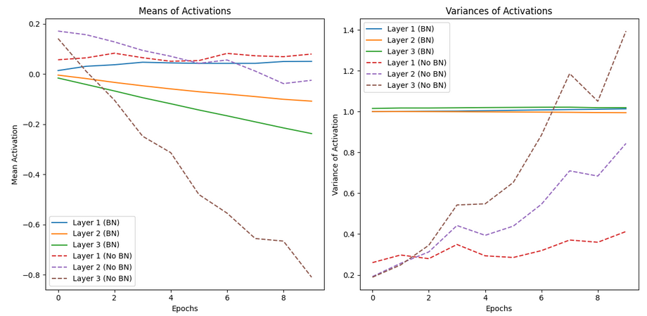
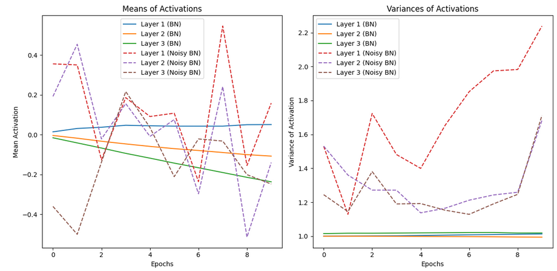
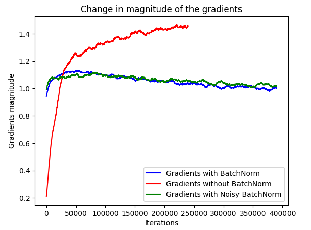

# Visual-Unfolding-of-Batch-Normalization

A visual exploration of BatchNorm's inner workings, demonstrating its impact on training Convolutional neural networks

### Overview

This repository contains a series of experiments to explore and visualize the impact of Batch Normalization when training Convolutional Neural Networks (CNNs).

### Experiment No. 1: Distribution of Activations

In the original Batch Normalization paper, the authors introduced the concept of internal covariate shift, which refers to the phenomenon where the distribution of each layer's inputs changes as the parameters of previous layers are updated during training. This shifting distribution can make training unstable leading to slow or poor convergence. Batch Normalization addresses this issue by normalizing the inputs to each layer ensuring that they have a consistent distribution. Specifically, a mean of 0 and a variance of 1 across the mini-batch. This normalization stabilizes training allowing the network to converge more quickly and efficiently.

In this experiment, I trained two Convolutional Neural Networks on the CIFAR-10 dataset using a custom architecture consisting of 3 convolutional layers and 2 fully connected layers. One network was trained with Batch Normalization, while the other was trained without it. During the training process, I recorded the mean and variance of the activations at each layer and plotted the results. The findings revealed that, when BatchNorm was used, the mean and variance of the activations remained stable throughout the epochs. In contrast, when BatchNorm was not applied, the mean and variance of the activations fluctuated significantly during training. This demonstrated the stabilizing effect of BatchNorm on the distribution of activations across the network.

### Experiment No. 2: Stability of Gradients

A paper published by MIT titled "How Does Batch Normalization Help Optimization?" discussed that while the exact reasons for BatchNorm’s effectiveness are not fully understood, it is often attributed to its control over the distribution of the input layers, also referred to as Internal Covariate Shift (ICS). However, the original paper provides little empirical evidence to directly support this claim, and the relationship between ICS and training performance remains unclear. The authors of this study argued that BatchNorm improves network training by smoothing the landscape of the optimization problem, making the gradients more predictable and thereby enabling faster convergence.

To investigate this further, I reimplemented the study by training three CNNs: one without BatchNorm, one with BatchNorm, and one with a modified version of BatchNorm that included added noise, which disrupted the usual stability provided by BatchNorm. Let's refer to this as Noisy BatchNorm. The results showed that, despite the instability in the mean and variance of activations in the Noisy BatchNorm network, the accuracy remained almost identical to that of the regular BatchNorm model. This suggests that addressing Internal Covariate Shift may not be the primary reason for BatchNorm’s success in improving network training.

    
### Results

| Approach         | Accuracy  
|------------------------|-------------------------|
| Without Batch Normalization | 64.11 | 
| With Batch Normalization     | 70.64 |
| With Batch Normalization + added Noise     | 69.09 |

The results from the second experiment suggest that Internal Covariate Shift is not directly related to training performance, at least not when considering the stability of the mean and variance of input distributions. To further investigate, I trained three CNNs with the same architecture and settings as in the previous experiment. This time, I focused on recording the magnitude of the gradients during training and plotted their behavior across iterations.

The findings revealed that the gradient magnitudes remained stable for both the BatchNorm and Noisy BatchNorm networks, while the network without BatchNorm exhibited significant instability in the gradients over different iterations. This observation indicates that BatchNorm's ability to smooth the optimization landscape leads to more stable and predictable gradients. As a result, the network with BatchNorm can take larger, more confident steps in the correct direction, contributing to faster convergence during training.

## References

- **Batch Normalization**: [Sergey Ioffe, Christian Szegedy](https://arxiv.org/pdf/1502.03167) - *Batch Normalization: Accelerating Deep Network Training by Reducing Internal Covariate Shift, 2015*
- **Why Batch Normalization works**: [Shibani Santurkar, Dimitris Tsipras, Andrew Ilyas, Aleksander Madry](https://arxiv.org/pdf/1805.11604) - *How Does Batch Normalization Help Optimization?, 2019*

